Parts Implemented by Emre Şahal
================================

Authors Table and Operations:

The authors table was implemented to hold the information related to the authors.  It contains a serial ID as a primary key. Also contains varchars name, last name, nationality, penname, description, picture and a numeric birthdate columns as local data.

insertAuthor:
This method is used to insert an author to the author table.  The requested values are taken from the admin and are given to the INSERT INTO query as inputs.

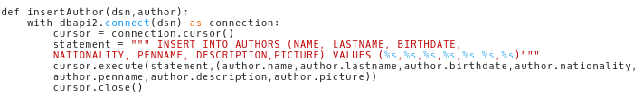

selectAuthor:
This method retrieves all of the authors in the database to display the existing authors.  This operation uses the SELECT query and then orders the authors by their ID’s using ORDER BY ID.

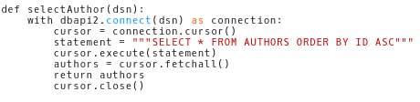

selectAuthorbyLastName:
This method is used to search for the users with the given last name. This method also uses the SELECT query.

.. figure:: static/sahalemre/authortable/selectAuthorbyLastName.png
    :alt: Figure 3. SQL code for the expalined function

selectAuthorbyId:
This method is used for retrieving a single author with the specific ID.  Since ID is the primary key of the table only one author can be selected. 

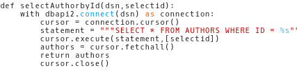

updateAuthor:
This method is used by the admin to update every value of a single author.  The author is defined by the ID and the SQL query UPDATE ... SET. 

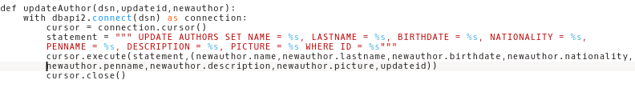

getBooksofAuthor:
This is actually an operation concerning the books table.  This method is used to select the titles of the books written by a specific author. 

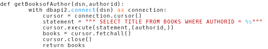

    
Groups Table and Operations:

This table is created to hold the data about groups created by users.  This table contains a primary key ID which is of type serial. A varchar type NAME to hold the name of the group and a foreign key OWNER that references the user in SITEUSER table who has created the group.

insertGroup:
This method takes the object group and inserts the name and owner values of to the table.

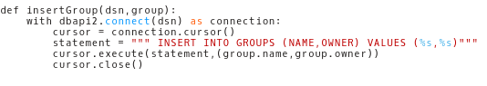

selectGroup:
This method is used to retrieve all of the groups in the database and orders them according to their ID’s in ascending order.  It uses the ORDER BY ID ASC query to order the fetched data.

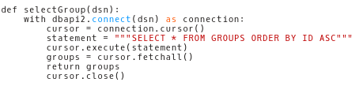

selectGroupbyName:
This method is used to retrieve all of the groups whose name is given as input. 

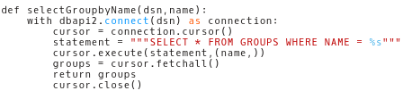

deleteGroup:
This method is used to remove a group from the database. 

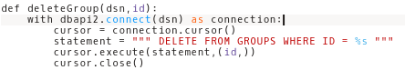

updateGroup:
This method is used for renaming a group.

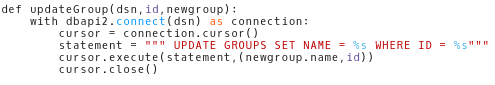

selectOwnerofGroup:
This method is used to fetch the owner of the group.  This function is used to check if the logged in user is the same with the fetched value and allow the deletion operation if the user is the owner of the group.

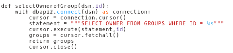

    
Members Table and Operations:

Since many users can join many groups and many groups can have many joined members, meaning since the relationship between users and groups are many to many a map table was necessary. This table has two foreign keys GROUPUSER and GROUPID.  The GROUPUSER is the foreign key which references the SITEUSER table to the corresponding user and the foreign key GROUPID references the table GROUPS to the respective group that the referenced user has joined.  These two foreign keys are the primary key.

insertMember:
This method is used to insert a tuple to the members table containing the ID of the user and the ID of the group the user is joining.

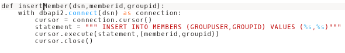

selectMember:
This method returns the tuple with a given GROUPUSER and GROUPID. This method is used to check if the requested tuple exists or not.  Basically this method checks if the user has already joined the group or not.

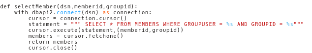

getMembersbyJoin:
This method uses the SQL query JOIN to join the tables MEMBERS and SITEUSER and fetched the usernames of the users which have joined to that specific group.  Rather than getting the ID’s of users and selecting from the SITEUSER table, the JOIN operation is used.

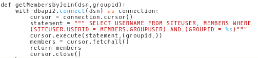

Group Comments Table and Operations:

This table holds the comments made in any group.  It contains the serial COMMENTID which is the primary of the table. It also contains two foreign keys, COMMENTER and GROUPCOMMENTED.  The COMMENTER column references the SITEUSER table and holds the ID of the user which has created the comment. The GROUPCOMMENTED column references the table GROUPS and holds the Id of the group where this comment was made.  Finally the varchar COMMENT holds the actual comment itself.

selectComments:
This method is used to retrieve the comments for a group.  It uses JOIN operation to join the SITEUSER and GROUPCOMMENTS table to show the comment and the username of the user who has commented.

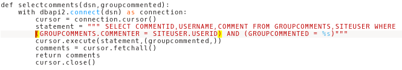

insertComment:
This method is used to insert a comment, its commenter and the group the comments been made to, to the database.

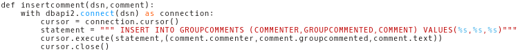

getCommenterbyCommentId:
This method retrieves the commenter of a specific comment. This method is used to check whether the logged in user is the one who created the comment or not.

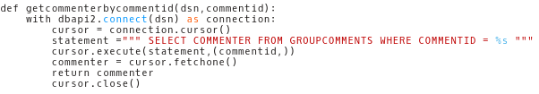

deleteCommentbyId:
This method is used to delete a specific comment from the database.

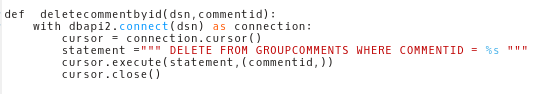
	
Author Comments Table and Operations:

This is mostly same with the group comments.  The ID is the primary key, the columns COMMENTER is a foreign key referencing the table SITEUSER and the column AUTHORCOMMENTED is the foreign key that references the Authors table to hold the referenced user and author ID’s respectively.  Lastly the varchar COMMENT contains the actual comment data the same as group comments. The operations are identical with the group comments.

selectAuthorComments:
This method is used to retrieve the comments for an author.  It uses JOIN operation to join the SITEUSER and AUTHORCOMMENTS table to show the comment and the username of the user who has commented.

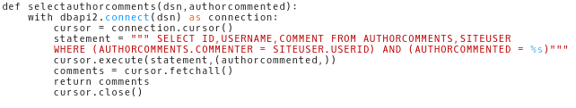

insertAuthorComment:
This method is used to add the comment values and the commented author to the table.

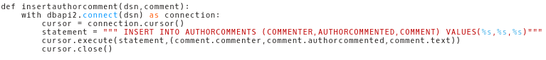

getAuthorCommenterbyCommentId:
This method retrieves the commenter of a specific comment. This method is used to check whether the logged in user is the one who created the comment or not.

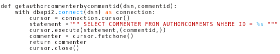

deleteAuthorCommentbyId:
This method is used to delete a specific comment from the database.

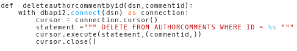