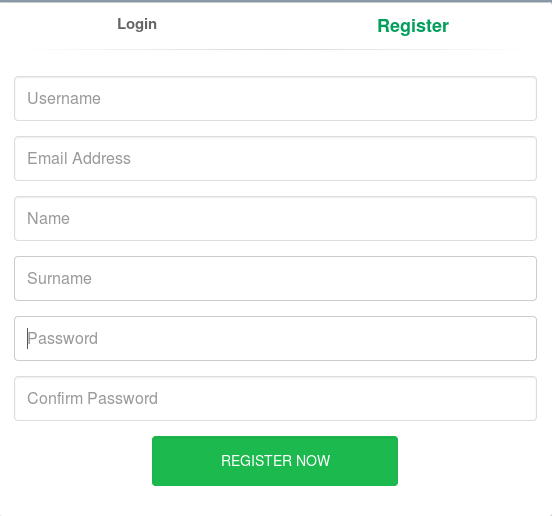
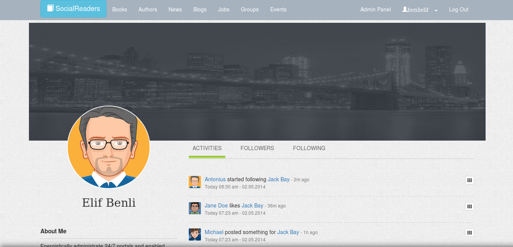
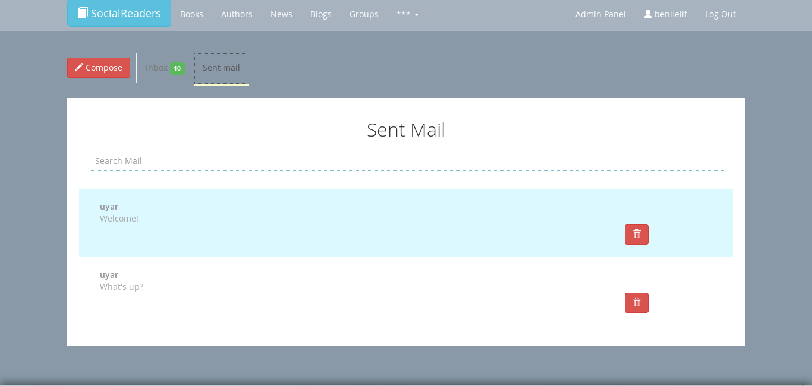
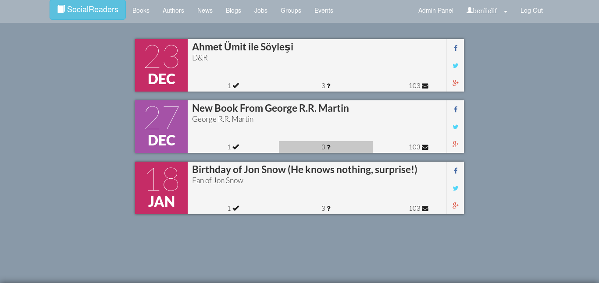

Parts Implemented by Elif Benli
===============================
In the project,  there are two types of users as admin and user. For the admin operations, admin panel was created. 

.. figure:: static/benliel/admin_panel.png 
   :alt: admin panel screenshot

   Here we see a screenshot of Admin Panel

In this interface following features are possible to perform
   1) Add new admins by add section in Users tab.
   
.. figure:: static/benliel/userAdd.png
   :alt: user add screenshot
   
   Here we see a screenshot of Add User
   
   2) Edit existing admin data by edit button in Users tab.

.. figure:: static/benliel/userUpdate.png
   :alt: user update screenshot
   
   Here we see a screenshot of Update User

   3) Delete existing admin data with clicking on delete button in Users tab.
   
To reach the site resources, login and register parts were created. The passwords don’t keep in the database. Instead of that, the hashes which are composing of passwords and randomly created salt keep in the database.

   
   Here we see a screenshot of Register
   
In this interface following features are possible to perform
   1) Register into the site after entering data.

.. figure:: static/benliel/login.png
   :alt: login screenshot
   
   Here we see a screenshot of Login      
   
In this interface following features are possible to perform
   1) Log into the site after entering username and password.

   
   Here we see a screenshot of Profile

In this interface following features are possible to perform
   1) Reach to user’s activities 
   2) Reach to user’s message

.. figure:: static/benliel/followers.png
   :alt: followers screenshot
   
   Here we see a screenshot of Followers  

In this interface following features are possible to perform
   1) Reach to user’s followers

.. figure:: static/benliel/followings.png
   :alt: followings screenshot
   
   Here we see a screenshot of Followings  

In this interface following features are possible to perform
   1) Reach to user’s followings
   2) If the user wants, unfollow the followed user

   
   Here we see a screenshot of Messages  

In this interface following features are possible to perform
   1) Reach to user’s sent and inbox messages.
   2) If the user wants, write a message by clicking to compose button.

When the user click on the any message, message details screen are opened.

.. figure:: static/benliel/messagedetail.png
   :alt: message detail screenshot
   
   Here we see a screenshot of Message Detail  

In this interface following features are possible to perform
   1) See the message details
   2) Reply the related message
   
In event page, two perspectives were created like admin and user perspective.

   
   Here we see a screenshot of Events For Users  
 
In this interface following features are possible to perform
   1) Users can see the nearby events.

.. figure:: static/benliel/events.png
   :alt: events for admins screenshot
   
   Here we see a screenshot of Events  For Admins 

In this interface following features are possible to perform
   1) Admins can add new event by clicking to ‘Create New’ button.
   
.. figure:: static/benliel/eventAdd.png
   :alt: event add screenshot
   
   Here we see a screenshot of Add Event
    
   2) Admins can edit an existing event by clicking to edit button.
   
.. figure:: static/benliel/eventUpdate.png
   :alt: event update screenshot
   
   Here we see a screenshot of Update Event
   
   3) Admins can delete an existing event by clicking to trash button.         