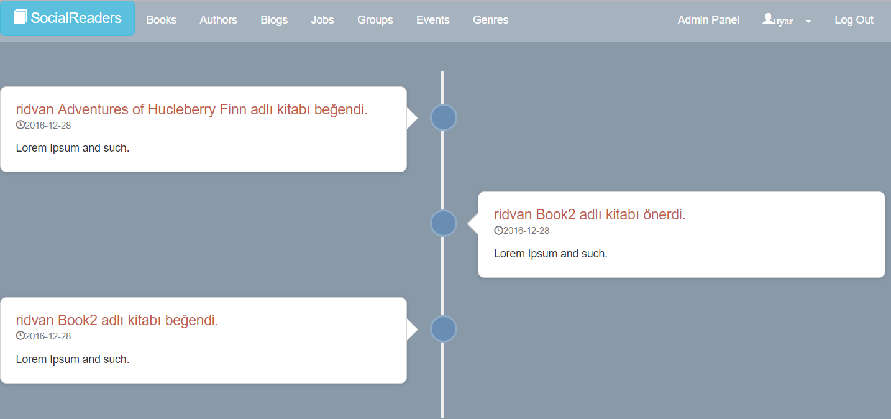
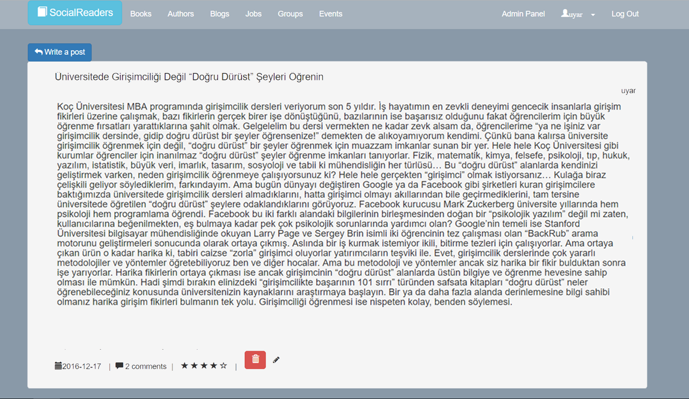
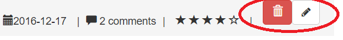
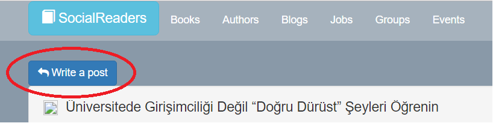
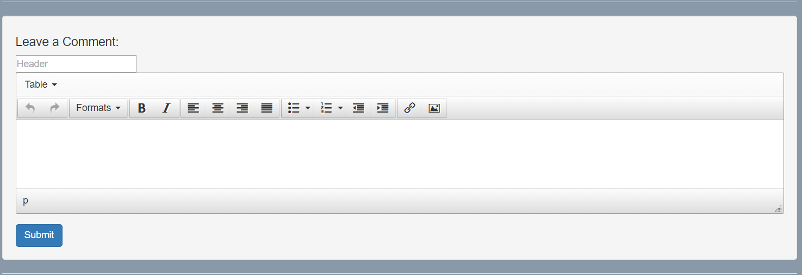
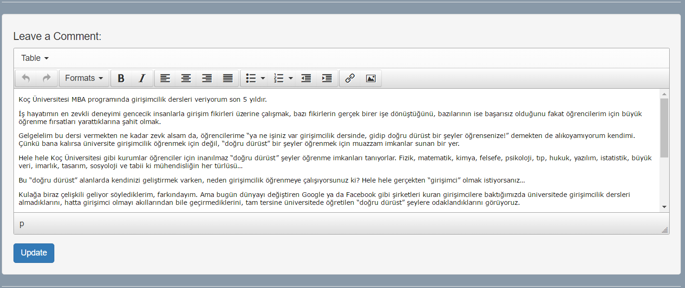
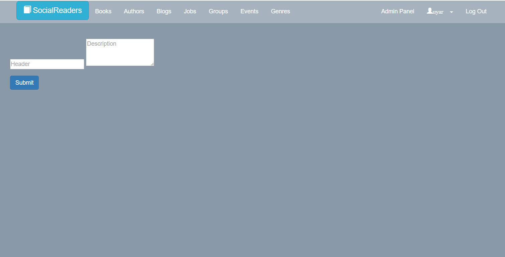

Parts Implemented by Rıdvan SIRMA
=================================
1.1-)Home

   In the home page, you can see all interactions between readers and books. For example, if an user likes a book, you can see it in the home page.

   Figure 1.1.1: ‘Write job posting’ page

1.2-)Blogs

   In the blogs page which is shown figure 1.2.1, you can read all post and you can be directed to delete or update page by clicking the delete or update button which is shown in figure 1.2.2. If you click the write a post button which is shown figure 1.2.3, then you are directed to write page which is shown in figure 1.2.4. In the write page, you must define a header for your post and you can submit the post, as shown figure 1.2.5. Update page uses the same working principle as the write page. The text box in the update page is already filled with the text you want to update. You can change the text and submit.

   Figure 1.2.1: Blogs Page

   Figure 1.2.2: ‘Delete’ and ‘update’ button

   Figure 1.2.3: 'Write a post’ button

   Figure 1.2.4: Write page

   Figure 1.2.5: Update page

1.3-) Jobs

   In the jobs page which is shown figure 1.3.1, if you are administrator on the site, you can write a job posting and manipulate the job posting by clicking the delete or update button. If you are not an administrator, you can only see job posting which is shown figure 1.3.2. If you click the describe a job button which is only shown if you are an administrator, then you are directed to write job posting which is shown in figure 1.3.3. In the describe page, you must define a header for your post and you can submit the job posting. Update page uses the same working principle as the describe page. The text box in the update page is already filled with the job posting you want to update. You can change the text and submit.

   Figure 1.3.1: Jobs page for administrator

   Figure 1.3.2: Jobs page for normal users

   Figure 1.3.3: ‘Write job posting’ page