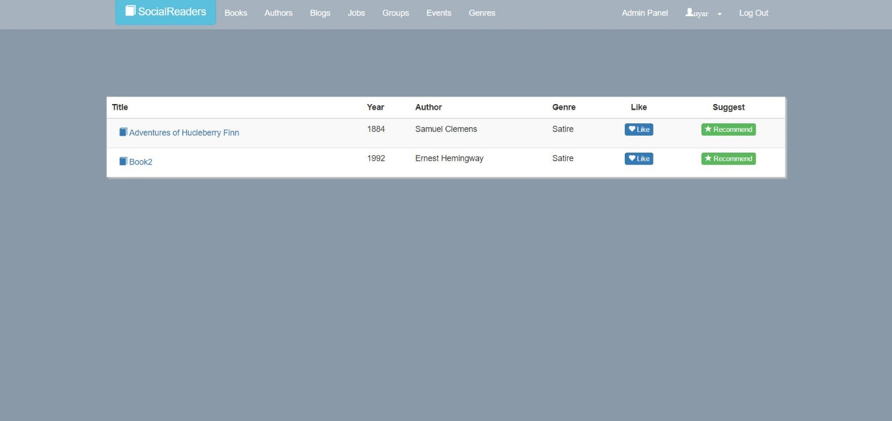
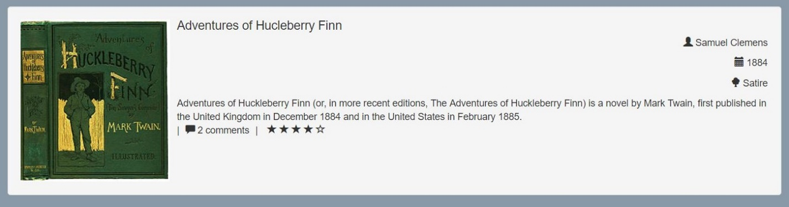
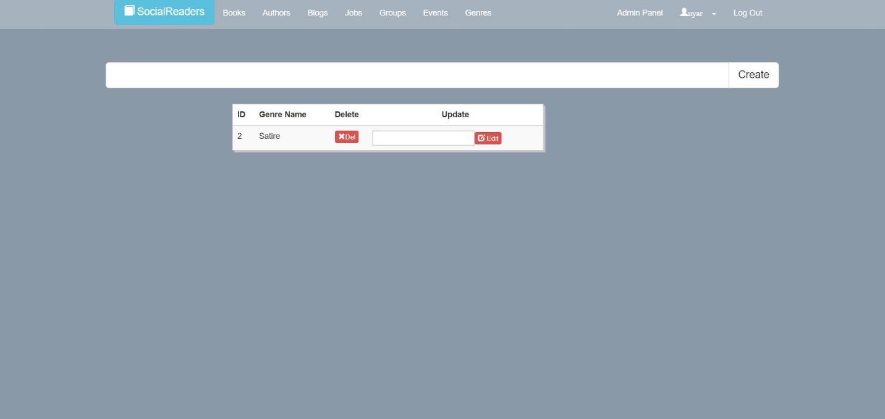
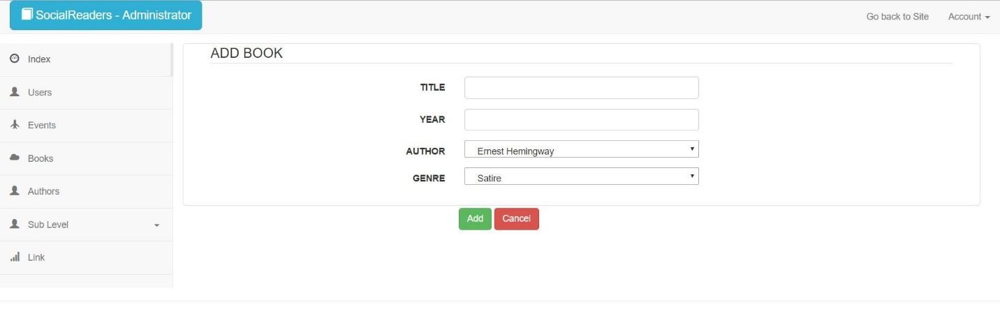
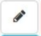

Parts Implemented by Metehan GÜLTEKİN
=====================================
In books page, there is a list of all books available in the site database.

   Here we see a screenshot of Books Page
In this interface following features are possible to perform
1. Users can click on book names to check book details.

   Here we see a screenshot of details of a book
2. Users can like or suggest a book to their followers.

Genres page is available to users in order to let them add new genre types into the database, fix their mistakes, and delete them if there is an unnecessary one.

   Here we see a screenshot of Genres Page
In this interface following features are possible to perform
1. Users can see the list of all genres available.
2. Users can delete an existing genre using “Del” button.
3. Users can edit an existing genre’s name if there is a mistake using “Edit” button.
4. Users can add new genres into the database using the textbox and the “Create” button above.

In the admin panel, there is also a page for managing books. Only admins can reach this panel, so only admins can do book managing operations.
.. figure:: static/gultekinmet/books_admin.jpg
   :alt: books admin panel screenshot

   Here we see a screenshot of Books Admin Panel
In this interface following features are possible to perform
1. Admins can add a new book using the Add Book page. They can access to this page using “Create New” button.

   Here we see a screenshot of adding a new book from Books Admin Panel
2. Admins can edit an already existing book using the “Edit” button.

While adding a new book or editing an existing one, admins should select one of the already available authors and one of the already available genres. If a book of another author or genre is going to be added, admins must go the related page first, and add the necessary authors or genres into these tables.
3. Admins can add or edit details to a book using the “Details” button.

4. Admins can delete a book if the book is no longer necessary using the “Delete” button.
