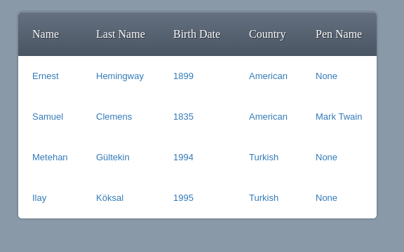
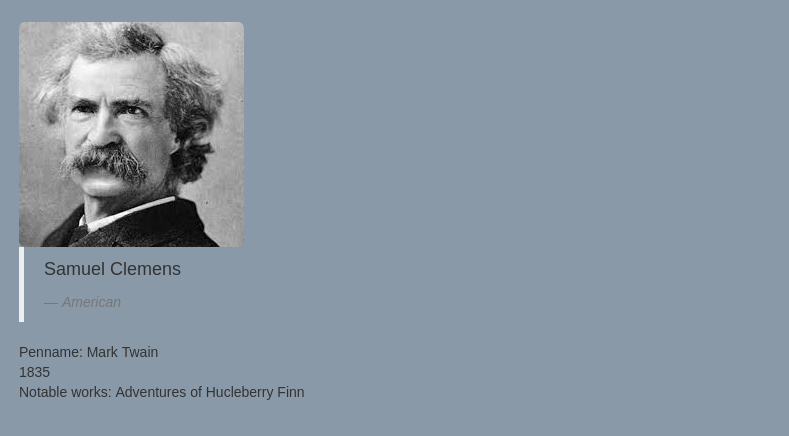
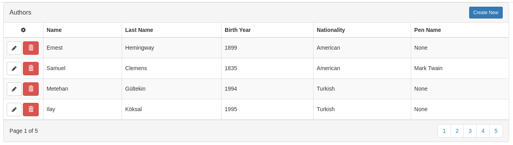
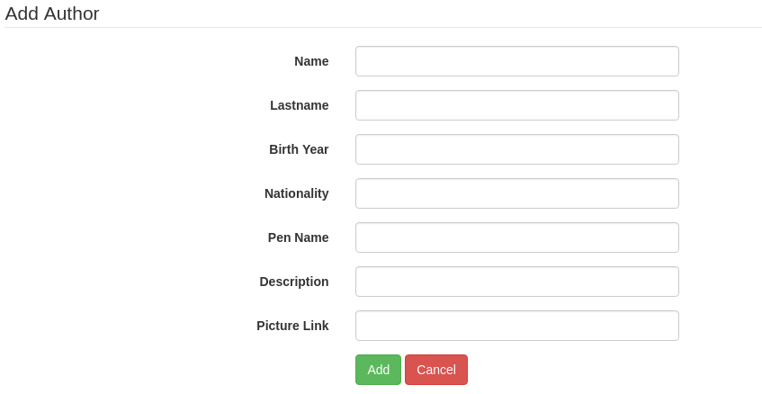
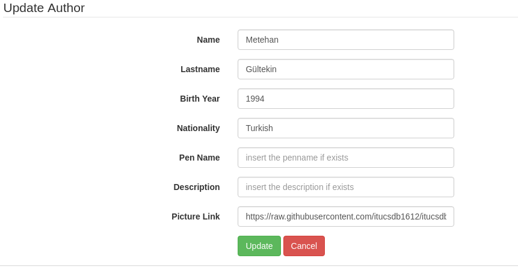
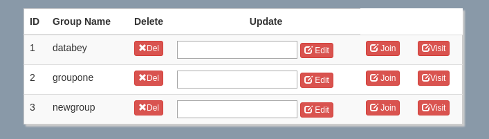
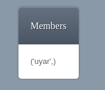

Parts Implemented by Emre Şahal
================================

Authors Page:
The first page is the authors page.  The authors page can be reached from the navigation bar.  This is a very simple page that lists the full names, birth years, nationalities and their pen name if the pen name exists. Figure 1 shows the list of authors. All of these list entries are links to the individual pages which direct the user to the individual pages of the author.  

In the individual page of an author new detailed information is given in addition to the information previously mentioned.  These are the detailed description of the selected author, the author’s picture and the book or other literary works by the author.  
This page also allows the user to comment on the author. The commenting mechanism is fairly simple.  You can write a comment to the text box and click the “share” button to share it.  It is also possible to delete a comment if it is the users comment.  This can be done by simply clicking the delete button under the comment that should be deleted.

    
    
.. figure:: static/sahalemre/authorpages/authorcomments.png
    :alt: Figure 3. Screenshot of the comments section of the author page

If the user has admin privileges then the user can add an author or can update or delete any given author.  These operations can only be done in the admin panel which is reachable from the navigation bar.  In the admin panel clicking the authors tab brings the general author admin page.  This page contains the list of the authors with the buttons for available options.  

The blue “Create New” button redirects the admin to the authoradd page.  Here the admin can enter the relevant information of the desired author to add the author to the system. Here some fields such as pen name, description and picture can be left blank if no relevant information exists. 

To update any information related with an author, the update button which is the left most button of the row can be clicked.  This action will direct the admin to the authorupdate page.  Here the admin can see the previous information related to the selected author and can update the necessary fields of the author.

Lastly if the admin clicks on the delete button, the author will be deleted from the system.

Groups Page:

The groups page can also be reached via the navigation bar.  In this page the existing groups of the site are listed.  A new group can be created by using the input area at the top of the page.  The name of the group can be given as an input.  Also additional group related operations can be done in this page.  You can update the group name by writing the new name and clicking edit button.  You can delete an existing group if you have created it by clicking the delete button of the group.  You can join multiple groups and you can visit the group page of the specific groups with the respective buttons.

    

    
In the page of a specific group you can see the list of members who have joined to the group.  In addition to this you can also leave comments to the group page.  Similar to the authors page, writing the comment to the text area and clicking share will create the comment and clicking the delete button under the specified comment will delete the comment if it was created by the logged in user.  The commenting interface is the same with the author page in Figure 3.

    
